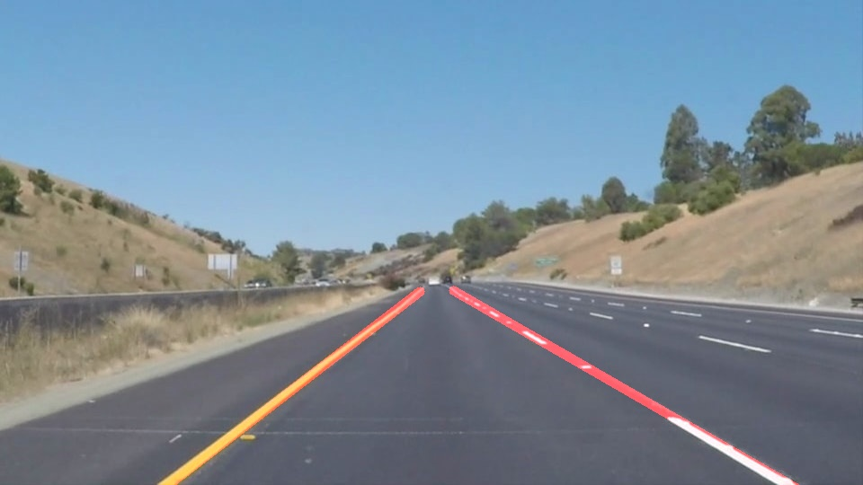

# **Finding Lane Lines on the Road** 

## Writeup

---

**Finding Lane Lines on the Road**

The goals / steps of this project are the following:
* Make a pipeline that finds lane lines on the road
* Reflect on your work in a written report

---

### Reflection

### 1. Describe your pipeline. As part of the description, explain how you modified the draw_lines() function.

My pipeline consisted of 8 steps.  

First I filtered white and yellow pixels 

then I converted the images to grayscale,  

then I applied gausian blur,   

then I used canny transfor,  

then I set region of interest, 

then I used hugh lines, divide lines to left and right, then I used linear regression to find lane lines, 
then I drawed the line. 

Finally i used weighted image function to merge initial image with detected lanes.  

In order to draw a single line on the left and right lanes,  
I modified the draw_lines() function by selecting left and right lines. 
Then in draw_line() function i used linear regression to find best aproximation. 

### 2. Identify potential shortcomings with your current pipeline

One potential shortcoming would be what would happen when someone drive at night, in snow, white cars  

Another shortcoming could be glare on the road or some other reflections that could be detected as extra line.   

Another shortcoming would be patches on asphalt algorithm could detect some extra lines.  

Distored images.

### 3. Suggest possible improvements to your pipeline

A possible improvement would be to focus more on images contating shadows like 

Another potential improvement would be camera calibration. 
